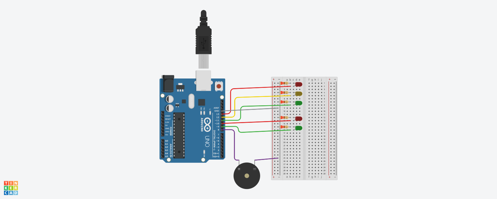

# Lab 1: Traffic Light Circuit

**Objective:**  
Design and simulate a basic traffic light with pedestrian signals using Arduino, including a musical buzzer and Serial Monitor messages.

**Components:**
- Arduino Uno (1)
- LEDs (5) – Red, Yellow, Green (traffic) + Red, Green (pedestrian)
- Resistors (5 × 220Ω)
- Buzzer (1)
- Breadboard (1)
- Jumper wires

**Features:**
- Traffic light sequence: Red → Green → Yellow
- Pedestrian lights synchronized with traffic lights
- Musical buzzer during pedestrian crossing (melody or rhythmic beep)
- Serial Monitor prints: STOP / GO / WAIT

**Simulation:**  
Circuit simulated in Tinkercad (class account) — screenshot included below.

**Preview:**  

**Code:**  
[TrafficLight.ino](TrafficLight.ino)
