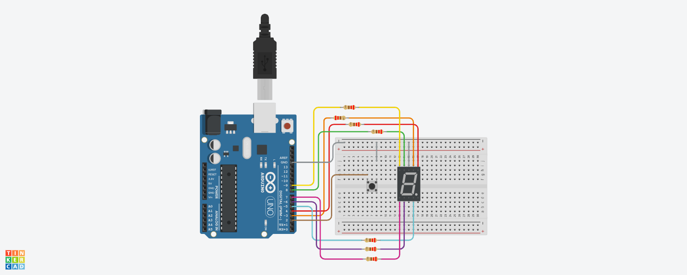

# Lab 2: Digital Dice Roller with 7-Segment Display

**Objective:**  
Simulate a digital dice using Arduino to demonstrate how a microcontroller processes inputs → CPU logic → outputs.  

**Components:**
- Arduino Uno (1)  
- Push Button (1)  
- 7-Segment Display (Common Cathode, 1)  
- Resistors (7 × 220Ω for segments, 1 for button optional)  
- Breadboard (1)  
- Jumper wires  

**Features:**
- Push button as input to roll dice  
- Random number generation (1–6) as processing  
- 7-Segment display shows result  
- Rolling animation before final result  
- Long press shows statistics: frequency count & relative probability (%)  
- Serial monitor prints rolls, counts, and percentages  

**Simulation:**  
Circuit simulated in Tinkercad (class account) — screenshot included below.

**Preview:**  
  

**Code File:**  
[DigitalDiceRoller.ino](DigitalDiceRoller.ino)
